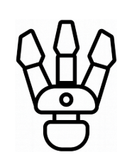
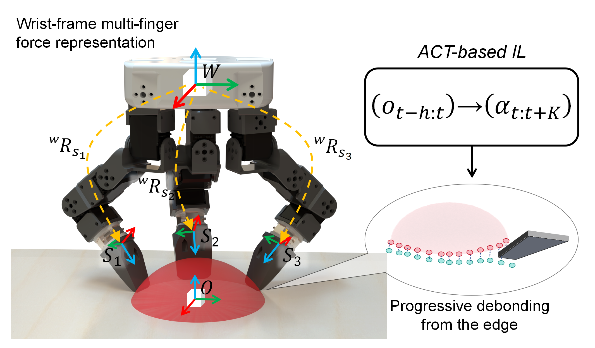

<!DOCTYPE html>
<html lang="en">
<head>
<meta charset="utf-8">
<title>OpenClaw Project Page</title>
<meta name="viewport" content="width=device-width, initial-scale=1">

</head>

<body>

<h1 class="main-title">
  
  OpenClaw: A Wrist-Frame Fingertip Force Sensing Hand for Contact-Rich Removal Manipulation
</h1>

  Author1 ·
  Author2 ·
  Author3 ·
  Author4

  University / Lab Name

  <a href="#">Paper</a>
  <a href="#video">Video</a>
  <a href="#">Code</a>
  <a href="#">Dataset</a>
  <a href="#">Hardware</a>

  <h2>Abstract</h2>
  

  We introduce OpenClaw, an open three-finger hand with modular three-axis fingertip force sensing and a wrist-frame multi-finger force representation, together with a nine-task contact-rich removal manipulation suite spanning adhesive detachment, cleaning, self-cleaning, and occluded retrieval. We evaluate a unified ACT-based imitation learning policy conditioned on RGB, joint state, and wrist-frame fingertip forces under strict success criteria and held-out real-robot tests, and use controlled ablations to quantify the contribution of wrist-frame force sensing in sequential contact interactions under uncertainty.
  

  <h2>Project Video</h2>
  

    <iframe src="https://www.youtube.com/embed/fToNWljt--Q" allowfullscreen></iframe>
  

  <h2>OpenClaw for Contact-Rich Removal Manipulation</h2>
  
  

  OpenClaw performs contact-rich removal behaviors (e.g., detachment and cleaning) by conditioning an ACT-based imitation learning policy on RGB, joint state, and wrist-frame multi-finger fingertip forces, enabling progressive debonding and sequential contact under uncertainty.
  

  <h2>Multimodal ACT Policy with Wrist-Frame Forces</h2>
  
  

  We express each fingertip force in a common wrist frame (via forward kinematics), encode RGB / joint state / contact forces, and predict an action chunk using an Action Chunking Transformer for robust contact-rich control.
  

  <h2>OpenClaw Platform and Real-Robot Evaluation Setup</h2>
  
  

  A leader–follower OpenClaw setup with multi-view cameras supports demonstration collection and held-out real-robot evaluation; inset shows the modular three-axis fingertip force sensor used for contact feedback.
  

<!-- ===== 3x3 YouTube hover grid (before teaser) ===== -->

<h2>Results Highlights</h2>

<iframe src="https://www.youtube.com/embed/yExUtIoSRzw?autoplay=1&mute=1&loop=1&playlist=yExUtIoSRzw&controls=0&rel=0&modestbranding=1" allow="autoplay"></iframe>

A1: Barnacle removal 

<iframe src="https://www.youtube.com/embed/cD3NlRmJ6lw?autoplay=1&mute=1&loop=1&playlist=cD3NlRmJ6lw&controls=0&rel=0&modestbranding=1" allow="autoplay"></iframe>

A2: 3D-print removal

<iframe src="https://www.youtube.com/embed/rsJYUgpaC-I?autoplay=1&mute=1&loop=1&playlist=rsJYUgpaC-I&controls=0&rel=0&modestbranding=1" allow="autoplay"></iframe>

A3: Blu-Tack removal

<iframe src="https://www.youtube.com/embed/hTsSUf5eFuc?autoplay=1&mute=1&loop=1&playlist=hTsSUf5eFuc&controls=0&rel=0&modestbranding=1" allow="autoplay"></iframe>

A4: Wood-ear extraction

<iframe src="https://www.youtube.com/embed/X9mF51GZDHo?autoplay=1&mute=1&loop=1&playlist=X9mF51GZDHo&controls=0&rel=0&modestbranding=1" allow="autoplay"></iframe>

A5: Self-cleaning

<iframe src="https://www.youtube.com/embed/fToNWljt--Q?autoplay=1&mute=1&loop=1&playlist=fToNWljt--Q&controls=0&rel=0&modestbranding=1" allow="autoplay"></iframe>

B1: Plate wiping

<iframe src="https://www.youtube.com/embed/fToNWljt--Q?autoplay=1&mute=1&loop=1&playlist=fToNWljt--Q&controls=0&rel=0&modestbranding=1" allow="autoplay"></iframe>

B2: Hand wiping

<iframe src="https://www.youtube.com/embed/fToNWljt--Q?autoplay=1&mute=1&loop=1&playlist=fToNWljt--Q&controls=0&rel=0&modestbranding=1" allow="autoplay"></iframe>

C1: Sand excavation

<iframe src="https://www.youtube.com/embed/fToNWljt--Q?autoplay=1&mute=1&loop=1&playlist=fToNWljt--Q&controls=0&rel=0&modestbranding=1" allow="autoplay"></iframe>

C2: Cat litter removal

  <h2>Citation</h2>
  <pre>
@article{openclaw2026,
title={OpenClaw: A Wrist-Frame Fingertip Force Sensing Hand for Contact-Rich Removal Manipulation},
author={Author1 and Author2 and Author3},
journal={Under Review},
year={2026}
}
  </pre>

  Project page template for robotics research papers

</body>
</html>
